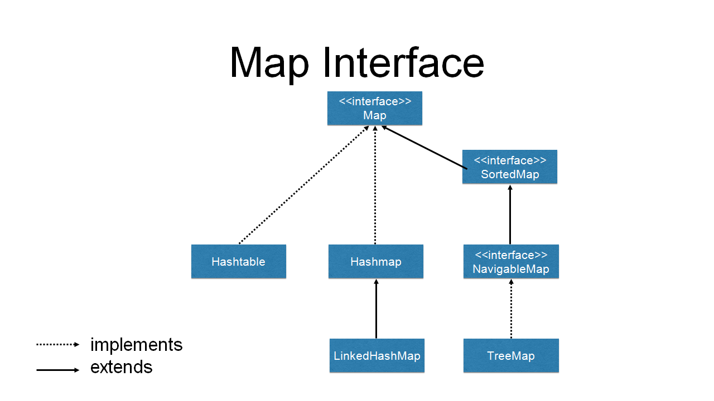

### 3) Map 인터페이스를 상속받는 클래스
##### [실습] [MapApp.java](https://github.com/swanstoz/TIL/blob/master/JAVA/API/java.util%20package/MapApp.java)

- HashMap, Hashtable, Properties 클래스 등
- `MapKey`와 `MapValue`를 하나의 정보로 묶어 표현 => 엔트리(`Entry`)      
- MapKey를 이용하여 MapValue 검색(MapKey 미중복) => 빠른 검색이 가능하다
- Map 인터페이스를 상속받은 자료구조 클래스는 키와 값의 제네릭 타입에 자료형 전달
  ```java
  Map<Integer, String> map=new HashMap<Integer, String>();
  ```
- Method
  - `Map.put(K key, V value)` : Map 인스턴스에 엔트리를 추가하는 메소드
    ```java
    map.put(1000, "홍길동");//오토박싱
    ```
    - 키는 내부적으로 Set 인터페이스 타입으로 저장되며 값은 Collection 인터페이스 타입으로 저장된다
    - 자료구조 클래스는 인스턴스 타입만 저장 가능하며([참고 - 210518.md](https://github.com/swanstoz/TIL/blob/master/JAVA/API/java.util%20package/MapApp.java)) Wrapper 클래스의 오토박싱 기능으로([참고 - 210517.md](https://github.com/swanstoz/TIL/blob/master/JAVA/API/java.lang%20package/210517.md)) 기본형 값을 사용할 경우 자동으로 인스턴스로 변환된다
    - 키는 중복되지 않으며 순서없이 저장된다
    - Map.put() 메소드 호출시 전달된 엔트리의 키가 중복될 경우 엔트리의 값이 변경된다
      ```java
      map.put(1000, "임꺽정");
      ```
      > 값이 "홍길동"에서 "임꺽정"으로 변경
  - `Map.toString()` : Map 인스턴스에 저장된 모든 엔트리를 문자열로 변환하여 반환하는 메소드
    - toString() 사용하지 않아도 자동 호출
  - `Map.remove(K key)` : Map 인스턴스에 저장된 엔트리 중 전달받은 키와 같은 엔트리를 삭제하는 메소드
  - `Map.get(K key)` : Map 인스턴스에 저장된 엔트리 중 전달받은 키와 같은 엔트리의 값을 반환하는 메소드
  - `Map.values()` : Map 인스턴스에 저장된 모든 엔트리의 값을 Collection 인스턴스로 반환하는 메소드
  - `Map.keySet()` : Map 인스턴스에 저장된 모든 엔트리의 키를 Set 인스턴스로 반환하는 메소드
  - `Map.iterator()` : Map 인스턴스에 저장된 요소를 반복 처리하기 위한 Iterator 인스턴스를 반환하는 메소드


- 일괄처리
  - 반복지시자(Iterator)를 이용한 일괄처리 - 엔트리의 값을 모두 반환하는 메소드 사용
    ```java
    Iterator<String> iteratorValue=map.values().iterator();
		while(iteratorValue.hasNext()) {
			System.out.print(iteratorValue.next()+" ");
		}
    ```
  - 반복지시자(Iterator)를 이용한 일괄처리 - 키의 값을 Set 인스턴스로 반환하는 메소드 사용
    ```java
    Iterator<Integer> iteratorKey=map.keySet().iterator();
		while(iteratorKey.hasNext()) {
			Integer key=iteratorKey.next();
			System.out.print(key+" = "+map.get(key));
		}
    ```
  - 변형된 for 구문을 이용한 일괄처리 - 엔트리의 값을 모두 반환하는 메소드 사용
    ```java
    for(String value:map.values()) {
			System.out.print(value+" ");
		}
    ```
  - 변형된 for 구문을 이용한 일괄처리 - 키의 값을 Set 인스턴스로 반환하는 메소드 사용
    ```java
    for(Integer key:map.keySet()) {
			System.out.println(key+" = "+map.get(key));
		}
    ```
    
---
##### [실습] [Student.java](https://github.com/swanstoz/TIL/blob/master/JAVA/API/java.util%20package/Student.java), [StudentManager.java](https://github.com/swanstoz/TIL/blob/master/JAVA/API/java.util%20package/StudentManager.java), [StudentManagerApp.java](https://github.com/swanstoz/TIL/blob/master/JAVA/API/java.util%20package/StudentManagerApp.java)

- List 인터페이스를 사용한 학생 정보 관리 프로그램
  - VO(Value Object) 클래스, BO(Business Object) 클래스, main 클래스
- 인스턴스의 필드값을 비교하기 위해 Comparable<T> 인터페이스를 상속받아 클래스를 작성
  - Comparable 인터페이스의 제네릭에는 비교하고자 하는 인스턴스의 클래스 전달
  - compareTo(T o) 메소드 오버라이드 선언
  ```java
  public class Student implements Comparable<Student> {
    //인스턴스의 필드값을 비교한 결과값을 반환하는 메소드
	  // => this의 필드값과 매개변수의 필드값을 빼기 연산한 결과값(양수, 0, 음수) 반환
	  //Collections.sort() 메소드 내부에서 호출되어 정렬의 기준 제공
	  // => 반환값이 양수인 경우 List 인스턴스의 요소를 서로 바꾸어 저장
	  @Override
	  public int compareTo(Student o) {
		  // TODO Auto-generated method stub
      //return this.num-o.num;//학번에 대한 오름차순 정렬
      //return o.num-this.num;//학번에 대한 내림차순 정렬
      //return this.name.compareTo(o.name);//이름에 대한 오름차순 정렬
		  return o.name.compareTo(this.name);//이름에 대한 내림차순 정렬
	  }
  }
  ```

  
  
---

### 정규표현식(Regular Expression)
**: Meta 문자, Escape 문자 등을 이용하여 일정한 규칙의 문자열을 표현하는 방법**
  > 유효성 검사에 활용
##### [실습] [ValidationApp.java](https://github.com/swanstoz/TIL/blob/master/JAVA/API/java.util%20package/ValidationApp.java)

- java.util.regex.Pattern : 정규 표현식을 저장하기 위한 클래스
  - `Pattern.matches(String regex, CharSequence input)` : 정규 표현식과 입력값을 전달받아 입력값에 대한 규칙을 비교하여 결과를 반환하는 메소드   
		=> false : 불일치, true : 일치
  - `Pattern.compile(String regex)` : 정규 표현식을 전달받아 Pattern 인스턴스에 저장하여 반환하는 메소드
- java.util.regex.Matcher : 정규표현식과 비교 문자열을 저장하기 위한 클래스
  - 정규 표현식과 문자열을 비교하는 기능 외 변경 또는 삭제 처리하는 기능 제공 - 폭넓게 정규표현식 활용 가능
  - `Pattern.matcher(CharSequence input)` : Pattern 인스턴스에 저장된 정규 표현식에 비교 문자열을 제공받아 저장한 Matcher 인스턴스를 반환하는 메소드
  - `Matcher.matches()` : Matcher 인스턴스에 저장된 정규 표현식과 문자열에 대한 규칙을 비교하여 결과를 반환하는 메소드  
    => false : 불일치, true : 일치
  
- 정규표현식  
  - `^문자` : 문자(열)로 시작됨을 의미
  - `문자$` : 문자(열)로 종료됨을 의미
  - `.` : 임의의 문자 하나를 의미(\ 문자 표현 불가능)
  - `[문자1문자2문자3]` : 나열된 문자들 중 하나를 의미
  - `[^문자1문자2문자3]` : 나열된 문자들이 아닌 문자들 중 하나를 의미
  - `[문자1-문자2]` : 문자1부터 문자2 범위의 문자 중 하나를 의미
  - `[문자열|문자열|문자열|]` : 나열된 문자열들 중 하나를 의미
  - `문자열+` : 문자열이 1번 이상 반복됨을 의미
  - `문자열*` : 문자열이 0번 이상 반복됨을 의미
  - `문자열?` : 문자열이 0번 또는 1번 존재함을 의미
  - `문자열{숫자}` : 문자열이 숫자만큼 반복됨을 의미
  - `문자열{숫자1,숫자2}` : 문자열이 숫자1부터 숫자2만큼 반복됨을 의미
  - `(?!)문자열` : 문자열에서 대소문자를 구분하지 않음을 의미
  - `(?=)문자열` : 문자열을 반드시 포함하고 있음을 의미
  - `(?!문자열)` : 문자열을 반드시 포함하고 있지 않음을 의미
  - `\s` : 공백이 존재하는 문자열을 의미
  - `\S` : 공백이 존재하지 않는 문자열을 의미
  - `\w` : 영문자, 숫자, 특수문자(_)의 문자로만 구성된 문자열을 의미
  - `\W` : 영문자, 숫자, 특수문자(_)의 문자를 제외한 문자들로 구성된 문자열을 의미
  - `\d` : 숫자 형태의 문자로만 구성된 문자열을 의미
  - `\D` : 숫자 형태의 문자를 제외한 문자들로 구성된 문자열을 의미
  - `\메타문자` : 메타문자를 일반문자로 표현
